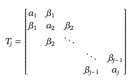
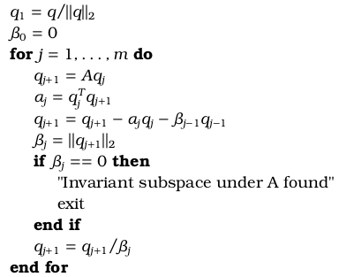
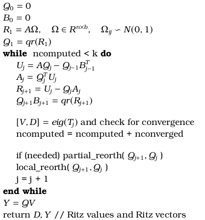
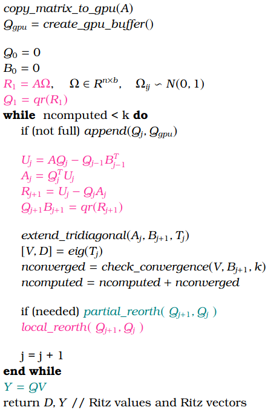

# Introduction

This repository contains my implementation of a GPU accelerated *Randomized Block Lanczos* method.

## Lanczos algorithm

Lanczos algorithm is one of the best methods to compute a few extreme eigenvalues and eigenvectors of large sparse symmetric matrices. It can be seen as the application of the *Gram-Schmidt*  method on a Krylov subspace. 

Given a matrix $A \in \mathbb{R}^{n \times n}$ and a starting vector $x \in \mathbb{R}^{n}$, Krylov subspaces are defined as 

$$ K_j (A,x) = span(x, Ax, A^2x, \dots, A^{j-1}x) $$

Lanczos algorithm produces an orthonormal basis $Q_j = (q_0\ q_1\ \dots\ q_{j-1})$ (Krylov vectors)that spans the subspace $K_j (A,x)$.

Using the *Rayleigh-Ritz* projection method, we can compute approximations to the extreme eigenpairs of matrix $A$ by solving the eigenproblem of the symmetric tridiagonal matrix $T_j \in \mathbb{R}^{j \times j}$

$$ T_j = Q_j^T A Q_j$$

Matrix $T_j$ contains scalar values that are computed by the Lanczos algorithm and are the coefficients that enforce orthogonality between the Krylov vectors.

The simple Lanczos algorithm is shown below

## Lanczos in Finite Precision Arithmetic

In finite precision arithmetic, the Krylov vectors lose their orthogonality due to roundoff errors. This means that the constructed basis is not orthonormal anymore and the computed eigenvalues and eigenvectors are wrong.

To handle this problem, stable implementations of the Lanczos method make use of two reorthogonalization schemes.

### Local reorthogonalization

Local reorthogonalization is used to improve the orthogonality between the two most recent Krylov vectors $q_{j}$ and $q_{j+1}$. Those vectors should be already orthogonal by construction but roundoff errors may prevent this from happening. With local reorthogonalization orthogonality is enforced up to the machine precision.

### Partial / Selective / Full reorthogonalization

Orthogonality is not only lost between $q_{j}$ and $q_{j+1}$ but also with respect to the previously computed Krylov vectors. To resolve this problem, there are various strategies including partial, selective or full reorthogonalization. Full reorthogonalization had been suggested by Lanczos but is usually too costly to be used. Partial and selective are used more often. 

## Randomized Block Lanczos algorithm

Many algorithms have blocked variants on which operations are done by blocks. With this way, better performance is achieved due to data locality and higher $\frac{operations}{data\ movement}$ ratio.

In block Lanczos algorithm, at each step a block of Kyrlov vectors is computed. To make them orthonormal, a $QR$ factorization is used.

The starting block $Q_0 \in \mathbb{R}^{n \times b}$ can be selected randomly but a more efficient strategy is to use a random sampling of the columns of matrix $A$. This can be described as

$$ Y = A \Omega\ , \quad \Omega \in \mathbb{R}^{n \times b}, \quad \Omega_{ij} \backsim N(0,1) $$

Our Randomized Block Lanczos implementation is shown below

### Randomized Block Lanczos on GPU

To accelerate our implementation using GPUs, we firstly detected the most costly steps of the algorithm. Those are

1. Computation of Ritz vectors
2. Multiplication with matrix $A$
3. Local reorthogonalization
4. Partial reorthogonalization

To impove the performance of those steps, we adopted the following stategies,

* Matrix $A$ was stored on the GPU memory in order to use *CuSPARSE* library for the multiplication $A Q_j$
* The two most recent blocks of Krylov vectors, $Q_j$ and $Q_{j-1}$, were alo stored in the GPU in order to improve the performance of the computation of $Q_{j+1}$
* We created a buffer based on the available remaining GPU memory on which we stored previously computed blocks of Krylov vectors. With this way, the partial reorthogonalization and the computation of the Ritz vectors could utilize the GPU.
* We used float precision arithmetic for the reorthogonalization operations and double precision arithmetic for the computation of each new $Q_i$ and the eigenpairs of matrix $T_j$. GPUs usually have much greater single than double precision performance expressed in GFLOPS.

In the following figure, our RBL GPU implementation is presented,

Magenta color denotes operations performed exclusively on GPU.
Teal color denotes hybrid operations performed on both CPU and GPU.
Black color denotes operations performed exclusively on CPU.
